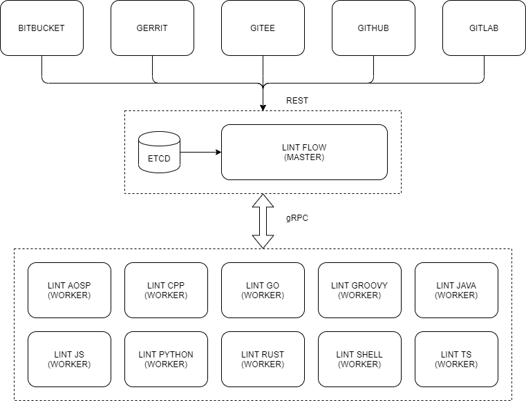

# lintaosp

[](https://github.com/craftslab/lintaosp/actions?query=workflow%3ACI)
[](https://hub.docker.com/r/craftslab/lintaosp)
[](https://github.com/craftslab/lintaosp/blob/master/LICENSE)
[](https://pypi.org/project/lintaosp)
[](https://github.com/craftslab/lintaosp/tags)


## Introduction

*lintaosp* is a lint worker of *[lintflow](https://github.com/craftslab/lintflow/)* on AOSP written in Python.


## Prerequisites

- Python >= 3.7


## Run

- **Local mode**

```bash
git clone https://github.com/craftslab/lintaosp.git

cd lintaosp
pip install -Ur requirements.txt
python aosp.py --config-file="config.yml" --output-file="output.json"
```


- **Service mode**

```bash
git clone https://github.com/craftslab/lintaosp.git

cd lintaosp
pip install -Ur requirements.txt
python aosp.py --config-file="config.yml" --listen-url="127.0.0.1:9090"
```


## Docker

- **Local mode**

```bash
git clone https://github.com/craftslab/lintaosp.git

cd lintaosp
docker build --no-cache -f Dockerfile -t craftslab/lintaosp:latest .
docker run -it -v /tmp:/tmp craftslab/lintaosp:latest ./lintaosp --config-file="config.yml" --output-file="/tmp/output.json"
```


- **Service mode**

```bash
git clone https://github.com/craftslab/lintaosp.git

cd lintaosp
docker build --no-cache -f Dockerfile -t craftslab/lintaosp:latest .
docker run -it -p 9090:9090 craftslab/lintaosp:latest ./lintaosp --config-file="config.yml" --listen-url="127.0.0.1:9090"
```


## Usage

```
TODO
```


## Settings

*lintaosp* parameters can be set in the directory [config](https://github.com/craftslab/lintaosp/blob/master/lintaosp/config).

An example of configuration in [config.yml](https://github.com/craftslab/lintaosp/blob/master/lintaosp/config/config.yml):

```yaml
apiVersion: v1
kind: worker
metadata:
  name: lintaosp
spec:
  lint:
    - strings
```


## Design




## Errorformat

- **Error type**

```
E: Error
I: Information
W: Warning
```

- **JSON format**

```json
{
  "fileName": "/path/to/file",
  "lineNum": 1,
  "colNum": 1,
  "errorNum": "1",
  "errorDetails": "details",
  "errorType": "E"
}
```

- **Text format**

```text
{fileName}:{lineNum}:{colNum}:{errorNum}:{errorDetails}:{errorType}
```


## License

Project License can be found [here](LICENSE).


## Reference

- [errorformat](https://github.com/reviewdog/errorformat)
- [etcd](https://etcd.io/docs/)
- [gRPC](https://grpc.io/docs/languages/python/)
- [protocol-buffers](https://developers.google.com/protocol-buffers/docs/proto3)
